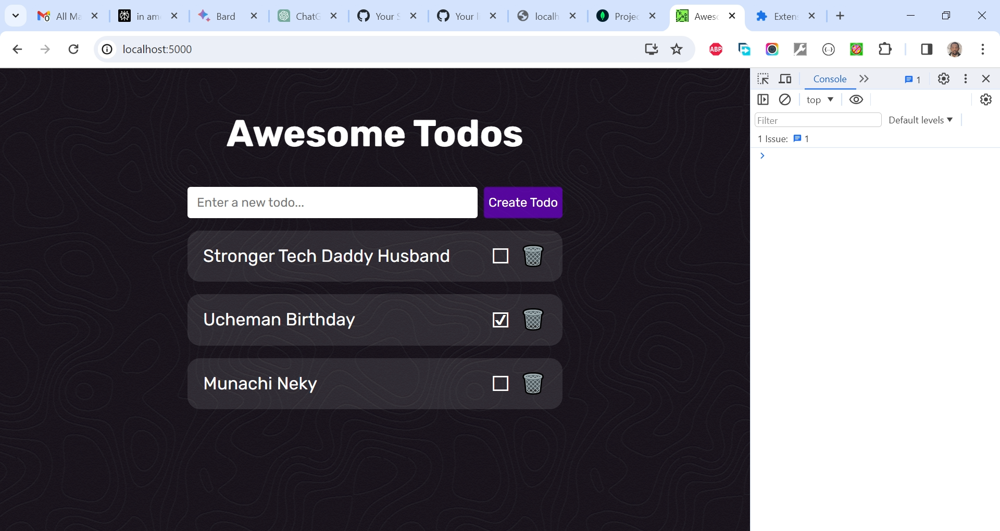

# Khurram Ali's Full Stack MERN Todo App Project

This is a solution to the [Khurram Ali's Full Stack MERN Todo App Project](https://www.youtube.com/watch?v=giXuiotopO0). I'm testing my hand creating very simple (follow along) projects for now to get familiar with the matter.

## Table of contents

- [Overview](#overview)
  - [The challenge](#the-challenge)
  - [Screenshot](#screenshot)
  - [Links](#links)
  - [My process](#my-process)
  - [Built with](#built-with)
  - [What I learned](#what-i-learned)
  - [Continued development](#continued-development)
  - [Useful resources](#useful-resources)
  - [Author](#author)
  - [Acknowledgments](#acknowledgments)

## Overview

### The Challenge/User Stories

In this comprehensive tutorial, I'll guide you through the process of building a full-stack MERN (MongoDB, Express, React, Node) Todo application from scratch. You'll learn how to create a responsive design and set up a REST API for managing your tasks. We'll cover every step from development to deployment, and you'll have access to all the essential resources.

### Screenshot

### Links

- Solution URL: [https://github.com/traez/full-stack-mern-todo-app](https://github.com/traez/full-stack-mern-todo-app)
- Live Site URL: [https://full-stack-mern-todo-app.onrender.com/](https://full-stack-mern-todo-app.onrender.com/)

## My process

### Built with

- Semantic HTML5 markup
- CSS custom properties
- Flexbox
- CSS Grid
- Mobile-first workflow
- [React](https://reactjs.org/) - JS library
- [Next.js](https://nextjs.org/) - React framework (No)
- Tailwind CSS
- Typescript (No)
- Nodejs
- Expressjs
- MongoDB

### What I learned

- Developed this React client application, constructing the frontend and incorporating it into the backend as a static file after building it using 'npm run build.' To ensure seamless communication, I employed a proxy in the package.json file and utilized relative paths for endpoint calls from the frontend.

- An alternative way of crafting this project would have been to making sure the backend and frontend are stored in separate repositories. In such a case I would further implement Cross-Origin Resource Sharing (CORS) policies to facilitate communication between them.

- This experience has equipped me with the skills to efficiently refactor a previous project, addressing incomplete deployments and enhancing overall deployment processes.

### Continued development

- More increasingly complex MERN stack projects.

### Useful resources

Stackoverflow  
YouTube  
Google  
ChatGPT

## Author

- Website - [Trae Zeeofor](https://github.com/traez)
- Twitter - [@trae_z](https://twitter.com/trae_z)

## Acknowledgments

To all MERN stack Developers and Content Creators. Well done!.
